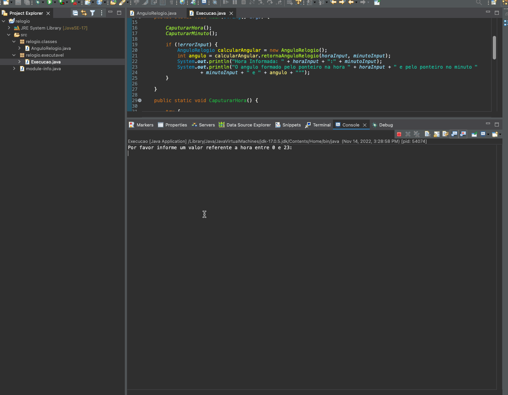
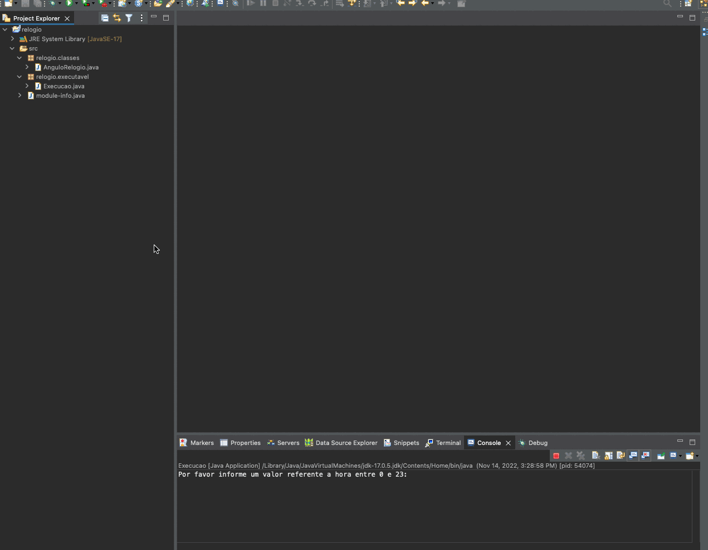

## **Test Neomind**

## **Challenge Logic and Programming**
- Objective:
    - The objective of this challenge is to demonstrate your skill and knowledge in programming logic. That way we'll know how you think.
- The Problem:
    - Write a program where, given a given time, it is able to
calculate the angle between the 2 hands of the clock.
    - Premise:
        1. Consider:
            - 00:00h has an angle of 0°
            - 00:15h has an angle of 90°
            - 00:30 h has an angle of 180°
        2. Method signature:
            - int retornaAnguloRelogio (int hora, int minuto);
        3. The challenge must be solved by writing in Java or natural language.
        4. If you have any doubts, make the decision that you think is the best.
    - Reply:
        ```` 
        Public int retornaAnguloRelogio (int hora, int minuto) { 
            // Implement the rest of the method
        }
        ````   


## ▶️  **Application in operation**


## 🔀&nbsp; **Application Code**




## 👨🏽‍🏫&nbsp; Instructions for execute the Project <a name="execute-project"></a>

1. Make a project copy to your machine:
    - git clone https://github.com/seiler-emerson/desafio_neomind.git
    - Or a direct download from the page [HERE](https://github.com/seiler-emerson/desafio_neomind).
    - Import the project into your IDE and execute the application.
        - Tutorial how to import a project in the Eclipse IDE [HERE](https://www.youtube.com/watch?v=R-8OF9ipeT8).
    - If you don't have eclipse installed, I made a video teaching how to install it, see [HERE](https://www.youtube.com/watch?v=cuq6E6lrbKc).

</br>

---

## 👨🏻‍🎓  **Author**

<br>

<table>
<thead>
	<tr>
		<th>
            <a href="https://seiler-emerson.github.io/">
                
            </a>
        </th>
	</tr>
</thead>
<tbody>
	<tr>
		<td>
            <a href="https://www.linkedin.com/in/seileremerson/">
                
            </a>
        </td>
	</tr>
</tbody>
</table>

<br>

---